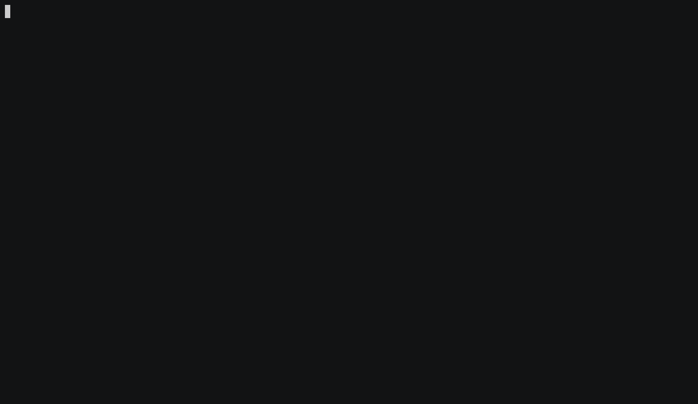

# TIL-Prompt

TIL-Prompt is an interactive terminal prompt for creating and managing a collection of TIL (Today I Learned) entries.


# Installation
To install from source using golang 1.16

```
go install github.com/roryq/til-prompt/cmd/til@vlatest
```

# Usage



Follow the prompts to save a new TIL entry.
A README.md is regenerated after each save.

<!--usage-shell-->
```
Usage: til <command>

An interactive prompt for managing TIL entries.

Flags:
  -h, --help    Show context-sensitive help.

Commands:
  config
    Displays the current configuration.

Run "til <command> --help" for more information on a command.
```

# License
[MIT](LICENSE)
